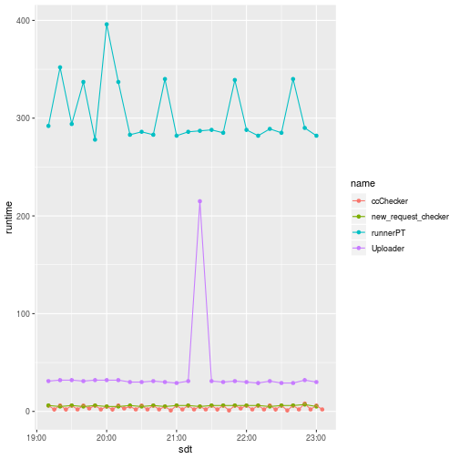

## Overall Status:

<!--html_preserve-->

<table class="gt_table">
  
  <thead class="gt_col_headings">
    <tr>
      <th class="gt_col_heading gt_columns_bottom_border gt_left" rowspan="1" colspan="1">error</th>
    </tr>
  </thead>
  <tbody class="gt_table_body">
    <tr class="gt_group_heading_row">
      <td colspan="1" class="gt_group_heading">../AV_LEAP/runnerPT.log</td>
    </tr>
    <tr>
      <td class="gt_row gt_left">label: error inventory</td>
    </tr>
    <tr>
      <td class="gt_row gt_left gt_striped">label: PT Error Emailer to Jeremy (with options) </td>
    </tr>
  </tbody>
  
  
</table>
<!--/html_preserve-->

## Last runs:

